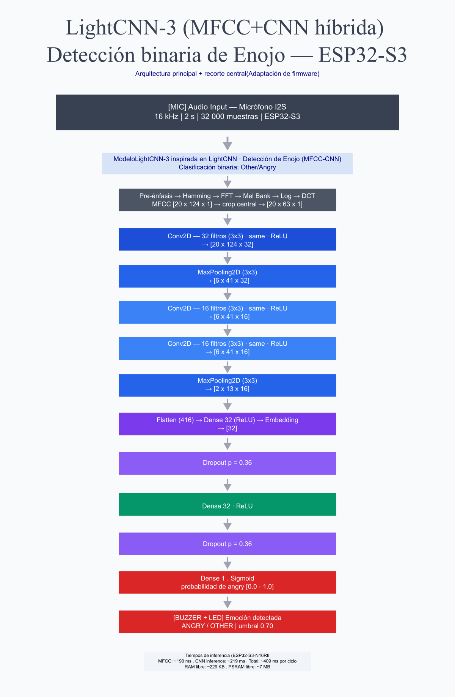

# Pipeline V2 profesional: Angry Voice Recognition en ESP32-S3-N16R8

## 1. Vision general del sistema

Este proyecto implementa un sistema embebido de reconocimiento emocional de voz sobre un **ESP32-S3-N16R8**. El objetivo no es reconocer todas las emociones del dataset, sino detectar de forma binaria si una muestra de voz corresponde a **Angry** o a **Other**.

El modelo usado en el proyecto es un modelo **hibrido MFCC + CNN ligera**. Contiene caracteristicas inspiradas en **LightCNN-9**, pero no debe presentarse como un LightCNN-9 puro. La arquitectura implementada es una variante compacta: usa extraccion MFCC, bloques convolucionales ligeros, reduccion espacial con max-pooling, una capa de embedding densa y una salida sigmoid para clasificacion binaria.

La ejecucion final ocurre directamente en el ESP32-S3-N16R8 usando **TensorFlow Lite Micro**, PSRAM, un microfono I2S, una matriz LED MAX72XX y un buzzer.

```text
Voz capturada por microfono I2S
        |
        v
Normalizacion y filtrado en ESP32-S3
        |
        v
Extraccion MFCC
        |
        v
CNN ligera hibrida inspirada en LightCNN-9
        |
        v
Salida sigmoid: Other / Angry
        |
        v
Matriz LED + buzzer
```

---

## 2. Plataforma embebida: ESP32-S3-N16R8

El hardware principal es un **ESP32-S3-N16R8**:

| Elemento | Significado |
|---|---|
| ESP32-S3 | Microcontrolador con soporte para aplicaciones de audio, IA ligera y perifericos digitales |
| N16 | 16 MB de memoria Flash |
| R8 | 8 MB de PSRAM |

La variante N16R8 es importante porque el sistema necesita memoria adicional para:

- almacenar el modelo convertido a arreglo C/C++;
- reservar el `tensor_arena` de TensorFlow Lite Micro;
- procesar buffers de audio de 2 segundos;
- guardar matrices intermedias de MFCC, FFT, filtros Mel y DCT.

En `platformio.ini` se habilita la PSRAM y se configura la memoria:

```ini
board = rymcu-esp32-s3-devkitc-1
board_build.psram = 1
board_build.arduino.memory_type = qio_opi
board_upload.flash_size = 16MB

build_flags =
    -DBOARD_HAS_PSRAM
    -DCONFIG_SPIRAM
    -DCONFIG_SPIRAM_USE_MALLOC
```

---

## 3. Arquitectura general del proyecto

El sistema completo esta dividido en cuatro bloques:

| Bloque | Funcion |
|---|---|
| Dataset y entrenamiento | Prepara audios, calcula MFCC y entrena el modelo binario |
| Modelo CNN hibrido | Aprende patrones acusticos asociados a enojo |
| Firmware ESP32-S3 | Captura audio, calcula MFCC y ejecuta inferencia local |
| Salida fisica | Muestra el resultado en matriz LED y activa buzzer si detecta Angry |

Flujo profesional del pipeline:

```text
Dataset ESD
        |
        v
Etiquetado binario
Angry = 1
Other = 0
        |
        v
Audio mono a 16 kHz
        |
        v
Segmentos de 2 segundos
        |
        v
Normalizacion / ruido blanco leve
        |
        v
MFCC manual compatible con firmware
        |
        v
Modelo MFCC + CNN ligera hibrida
        |
        v
Exportacion a TensorFlow Lite
        |
        v
Conversion a arreglo C/C++
        |
        v
Ejecucion en ESP32-S3-N16R8 con TFLite Micro
```

---

## 4. Dataset y adaptacion binaria

El entrenamiento usa el dataset **ESD (Emotional Speech Dataset)** ubicado en:

```text
Dataset/ESD/Emotional_Speech_Dataset/
```

El dataset contiene dos idiomas:

- `Chinese`
- `English`

Y cinco emociones:

- `angry`
- `happy`
- `neutral`
- `sad`
- `surprise`

Para este proyecto se transforma en un problema binario:

| Emocion original | Clase final | Etiqueta |
|---|---|---:|
| angry | Angry | 1 |
| happy | Other | 0 |
| neutral | Other | 0 |
| sad | Other | 0 |
| surprise | Other | 0 |

La pregunta que responde el modelo es:

```text
La voz contiene enojo?
```

No intenta clasificar las cinco emociones por separado. Agrupa todo lo que no es enojo como `Other`.

---

## 5. Formato de audio

La configuracion de audio se mantiene coherente entre Python y el firmware:

| Parametro | Valor |
|---|---:|
| Frecuencia de muestreo | 16000 Hz |
| Duracion por muestra | 2 s |
| Muestras por bloque | 32000 |
| Formato en firmware | I2S, 32 bits |
| Canal I2S | Derecho |

En `src/MFCC.h`:

```cpp
#define SAMPLING_RATE 16000
#define TOTAL_TIME 2
#define SHAPE_INPUT SAMPLING_RATE*TOTAL_TIME
```

Cada ciclo analiza un bloque de 2 segundos de audio.

---

## 6. Extraccion MFCC

El modelo no recibe audio crudo. Primero se transforma la senal en caracteristicas MFCC.

Los MFCC resumen la forma espectral de la voz en una representacion compacta. Son adecuados para reconocimiento de voz y emociones porque describen como se distribuye la energia en frecuencias perceptualmente relevantes.

Pipeline MFCC:

```text
Audio normalizado
        |
        v
Preenfasis
        |
        v
Ventana Hamming
        |
        v
FFT
        |
        v
Espectro de potencia
        |
        v
Banco de filtros Mel
        |
        v
Logaritmo
        |
        v
DCT
        |
        v
Matriz MFCC
```

Parametros usados:

| Parametro | Valor |
|---|---:|
| Ventana | 512 muestras |
| Salto | 256 muestras |
| Frecuencia minima | 20 Hz |
| Frecuencia maxima | 8000 Hz |
| Bandas Mel | 20 |
| Ventanas temporales completas | 124 |
| Region central usada en firmware | 63 frames |

Nota tecnica: con 32000 muestras, ventana de 512 y salto de 256, el calculo completo genera:

```text
((32000 - 512) / 256) + 1 = 124 ventanas
```

En el firmware se conserva el calculo de `NUMBER_OF_WINDOWS = 124` y se aplica un recorte central de 63 frames como region informativa. Para documentacion de arquitectura del modelo entrenado, los notebooks muestran la entrada completa como `20 x 124 x 1`; para la parte embebida se puede explicar que se concentra la informacion util alrededor del centro del segmento.

---

## 7. Que es LightCNN-9 y como se usa aqui

**LightCNN-9** es una arquitectura convolucional ligera pensada para extraer caracteristicas discriminativas con menos costo computacional que redes mas grandes. Su idea principal es usar bloques convolucionales compactos, reduccion espacial y una capa de embedding antes de la clasificacion.

En arquitecturas LightCNN clasicas tambien aparece el concepto **MFM (Max-Feature-Map)**, que reduce redundancia seleccionando las respuestas mas fuertes entre mapas de caracteristicas. Este proyecto no implementa un LightCNN-9 canonico completo ni una pila literal de 9 capas con MFM.

Lo correcto es describirlo asi:

```text
Modelo hibrido MFCC + CNN ligera con caracteristicas inspiradas en LightCNN-9.
```

El modelo toma ideas de LightCNN:

- uso de una CNN compacta;
- pocas capas convolucionales;
- reduccion de dimensionalidad con `MaxPooling2D`;
- embedding denso antes de clasificar;
- baja cantidad de parametros;
- arquitectura viable para un microcontrolador con PSRAM.

Pero la arquitectura real implementada es mas pequena que LightCNN-9: tiene **3 capas convolucionales principales**, no una red LightCNN-9 completa.

---

## 8. Arquitectura del modelo CNN hibrido

El siguiente diagrama resume la arquitectura principal del sistema y muestra de forma separada el recorte central aplicado en el firmware:



Nota: la arquitectura base documentada y observada en el modelo entrenado usa entrada `20 x 124 x 1`. El recorte a `63 frames` corresponde a una adaptacion del firmware para concentrar la region central de la matriz MFCC.

La arquitectura implementada en los notebooks es una CNN ligera inspirada en LightCNN:

```text
Input MFCC
        |
        v
Conv2D 32 filtros 3x3 + ReLU + L2
        |
        v
MaxPooling2D 3x3
        |
        v
Conv2D 16 filtros 3x3 + ReLU
        |
        v
Conv2D 16 filtros 3x3 + ReLU
        |
        v
MaxPooling2D 3x3
        |
        v
Flatten
        |
        v
Dense 32 + ReLU + L2
        |
        v
Dropout 0.36
        |
        v
Dense 32 + ReLU
        |
        v
Dropout 0.36
        |
        v
Dense 1 + Sigmoid
```

Detalle por capas usando la entrada completa observada en el resumen del modelo:

| Etapa | Capa | Salida | Parametros |
|---|---|---:|---:|
| Entrada | MFCC | `20 x 124 x 1` | 0 |
| 1 | Conv2D, 32 filtros, 3x3, ReLU | `20 x 124 x 32` | 320 |
| 2 | MaxPooling2D, 3x3 | `6 x 41 x 32` | 0 |
| 3 | Conv2D, 16 filtros, 3x3, ReLU | `6 x 41 x 16` | 4624 |
| 4 | Conv2D, 16 filtros, 3x3, ReLU | `6 x 41 x 16` | 2320 |
| 5 | MaxPooling2D, 3x3 | `2 x 13 x 16` | 0 |
| 6 | Flatten | `416` | 0 |
| 7 | Dense 32, ReLU, L2 | `32` | 13344 |
| 8 | Dropout 0.36 | `32` | 0 |
| 9 | Dense 32, ReLU | `32` | 1056 |
| 10 | Dropout 0.36 | `32` | 0 |
| 11 | Dense 1, Sigmoid | `1` | 33 |

Resumen del modelo:

| Metrica | Valor |
|---|---:|
| Parametros totales | 21697 |
| Parametros entrenables | 21697 |
| FLOPS aproximados | 10039618 |
| Complejidad | Baja |
| Salida | Sigmoid binaria |

La salida sigmoid produce un valor entre `0.0` y `1.0`:

```text
0.0 -> Other
1.0 -> Angry
```

En el firmware se usa un umbral:

```cpp
int result = (val_angry >= 0.70) ? 1 : 0;
```

Por lo tanto, solo se declara `Angry` cuando la probabilidad estimada de enojo es mayor o igual a `0.70`.

---

## 9. Por que el modelo es hibrido

El sistema es hibrido por dos razones:

| Componente | Aporte |
|---|---|
| MFCC | Extrae caracteristicas acusticas compactas desde la senal de voz |
| CNN ligera | Aprende patrones espaciales sobre la matriz MFCC |
| Inspiracion LightCNN | Mantiene una red pequena, con capas convolucionales compactas y embedding |
| TensorFlow Lite Micro | Permite ejecutar la inferencia en un microcontrolador |

En vez de enviar audio crudo a una red grande, el sistema usa procesamiento digital de senales para reducir el problema. Luego una CNN pequena clasifica esa representacion. Esto hace viable la ejecucion en un ESP32-S3-N16R8.

---

## 10. Firmware en ESP32-S3

El firmware ejecuta el pipeline en tiempo real:

```text
Captura I2S
        |
        v
Buffer de 32000 muestras
        |
        v
Normalizacion y filtrado
        |
        v
Filtro de energia
        |
        v
MFCC en firmware
        |
        v
Copia al tensor de entrada
        |
        v
Inferencia TensorFlow Lite Micro
        |
        v
Interpretacion sigmoid
        |
        v
Matriz LED y buzzer
```

Archivos principales:

| Archivo | Responsabilidad |
|---|---|
| `src/main.cpp` | Flujo principal: I2S, energia, MFCC, inferencia y salida |
| `src/MFCC.cpp` | Implementacion de MFCC optimizada para ESP32 |
| `src/MFCC.h` | Parametros de audio y MFCC |
| `src/NeuralNetwork.cpp` | Carga del modelo, tensor arena, resolver e inferencia |
| `src/model_data.h` | Declaracion del modelo TFLite convertido |
| `src/modelo_tesis_binario_Angry_finalv5.cc` | Modelo en bytes C/C++ |
| `src/emotions.cpp` | Patrones visuales para matriz LED |

---

## 11. Optimizaciones de memoria

El ESP32-S3-N16R8 usa PSRAM para sostener las partes pesadas del sistema:

- audio crudo `int32_t`;
- audio normalizado `float`;
- matriz MFCC;
- matrices de FFT, filtros Mel y DCT;
- `tensor_arena` de TensorFlow Lite Micro.

En `NeuralNetwork.cpp`:

```cpp
const size_t kArenaSize = 600000;
```

El `tensor_arena` se reserva en PSRAM con alineacion a 16 bytes:

```cpp
tensor_arena = (uint8_t *)heap_caps_malloc(
    alloc_size,
    MALLOC_CAP_SPIRAM | MALLOC_CAP_8BIT
);
```

Esto evita saturar la RAM interna del microcontrolador y permite que el modelo pueda ejecutarse de forma estable.

---

## 12. Operaciones TensorFlow Lite Micro

El firmware registra solamente las operaciones necesarias para el modelo:

```cpp
resolver_instance.AddFullyConnected();
resolver_instance.AddLogistic();
resolver_instance.AddReshape();
resolver_instance.AddConv2D();
resolver_instance.AddMaxPool2D();
resolver_instance.AddL2Normalization();
```

Esto es importante en sistemas embebidos porque no se carga un runtime completo de TensorFlow, sino un conjunto minimo de kernels. Asi se reduce consumo de memoria y se controla mejor el firmware.

---

## 13. Tiempos de inferencia medidos en ESP32-S3-N16R8

El firmware ya mide los tiempos con `micros()` en `src/main.cpp`:

```cpp
long int t1 = micros();
mfccs(inputAudio, mfcc_mat);
long int t2 = micros();

long int t3 = micros();
bool success = nn->predict();
long int t4 = micros();
```

Valores observados en `salidasEnSerialMonitor.txt`:

| Medicion | Tiempo aproximado |
|---|---:|
| MFCC | 189.95 ms |
| Inferencia CNN | 218.91 ms |
| Total procesamiento | 409.12 ms |
| RAM interna libre | 229 KB |
| PSRAM libre | 7195 KB |

Resumen para exposicion:

```text
Tiempos de inferencia en ESP32-S3-N16R8
MFCC: ~190 ms
CNN inference: ~219 ms
Total: ~409 ms por ciclo de procesamiento
RAM libre: ~229 KB
PSRAM libre: ~7 MB
```

Nota: el tiempo total mostrado corresponde al procesamiento desde el inicio del calculo MFCC hasta el final de la inferencia. 

---

## 14. Salida del sistema

El resultado se comunica de dos formas:

| Resultado | Accion |
|---|---|
| Other | Muestra patron neutral/other en matriz LED |
| Angry | Muestra patron Angry y activa buzzer |
| Silencio | Evita inferencia si la energia es baja |

El filtro de energia evita ejecutar el modelo cuando el bloque de audio contiene silencio o ruido muy bajo:

```cpp
if (energia < 0.02) {
    emotion(0, Mat, 0, mxObj);
    digitalWrite(BUZZER_PIN, LOW);
    return;
}
```

Cuando se detecta enojo:

```cpp
digitalWrite(BUZZER_PIN, (feeling == 1) ? HIGH : LOW);
```

---

## 15. Resumen ejecutivo

Este proyecto implementa un detector binario de enojo en voz usando un **ESP32-S3-N16R8**. La senal se captura con un microfono I2S a 16 kHz, se procesa en bloques de 2 segundos, se transforma a MFCC y se clasifica con una CNN ligera hibrida inspirada en LightCNN-9.

El modelo no es un LightCNN-9 puro. Es una arquitectura compacta con **3 capas convolucionales principales**, dos etapas de max-pooling, una capa de embedding densa y una salida sigmoid. Por eso la descripcion tecnicamente correcta es:

```text
MFCC + CNN ligera hibrida con caracteristicas inspiradas en LightCNN-9.
```

Gracias a la PSRAM del ESP32-S3-N16R8, el sistema puede alojar el modelo, reservar el `tensor_arena` de TensorFlow Lite Micro y procesar matrices MFCC sin depender de una computadora externa.

El rendimiento medido es de aproximadamente:

```text
~190 ms para MFCC
~219 ms para inferencia CNN
~409 ms de procesamiento total
~229 KB de RAM interna libre
~7 MB de PSRAM libre
```

Con esto, el proyecto demuestra un pipeline completo de IA embebida: desde dataset y entrenamiento en Python hasta inferencia local en microcontrolador con salida visual y sonora.
